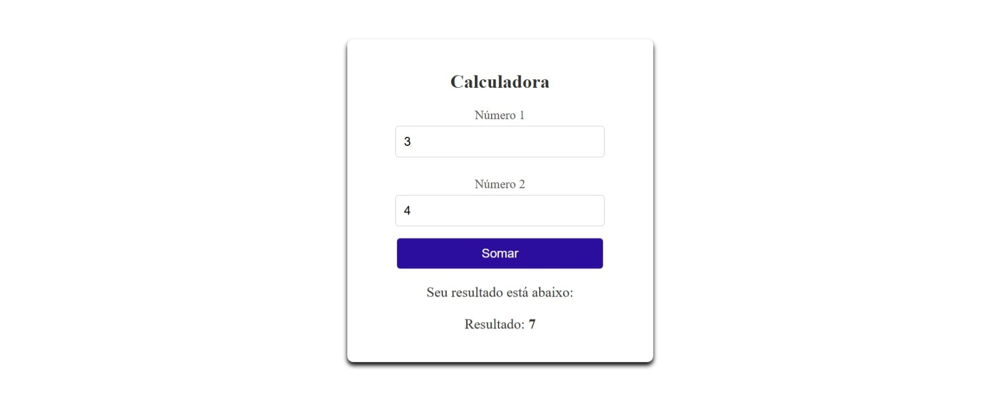

# Exercício 01 – Conceitos Básicos em Angular

Bem-vindo ao primeiro exercício do curso de Angular 20.  
Este projeto tem como objetivo apresentar os **conceitos fundamentais do Angular**, entendendo a estrutura de um projeto, componentes, módulos e interações básicas.



## Tecnologias Utilizadas

- **Angular 20**
- **TypeScript**
- **Angular CLI**

## Conceitos Abordados

- Estrutura de projetos Angular
- Components e Modules
- Data Binding
- Interações entre template e component
- Primeira página em Angular
- Calculadora simples

## :information_source: Instalação

### Pré-requisitos

- **Node.js**
- **Angular CLI**
- **Git**

### Passos para executar

```bash
# Acesse a pasta do projeto
cd conceitos-basicos

# Instale as dependências
npm install

# Execute o projeto
ng serve --open

# Acesse
http://localhost:4200
