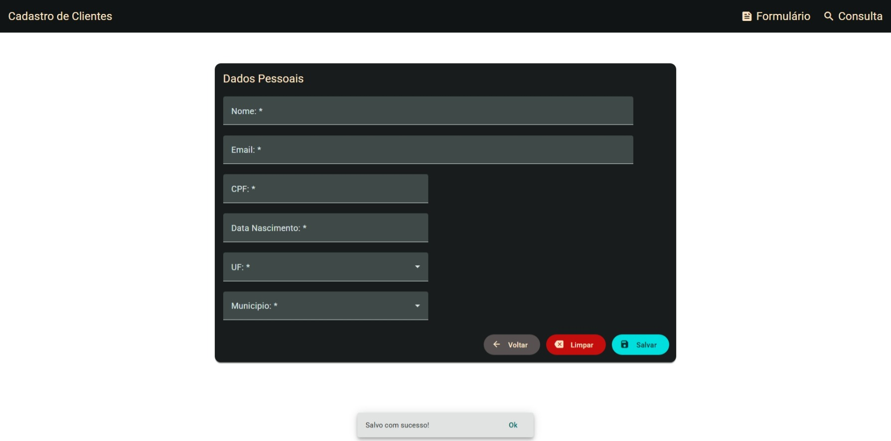
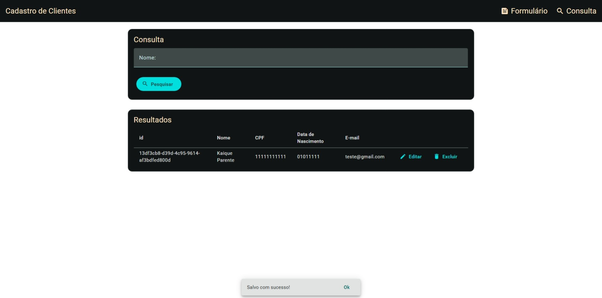

# Exercício 03 – CRUD com Angular Material

Este exercício consiste na criação de um **CRUD completo**, utilizando Angular Material e Services para consumir uma **API REST existente**.




## Tecnologias Utilizadas

- **Angular 19**
- **Angular Material**
- **TypeScript**
- **API REST**

## Conceitos Abordados

- CRUD (Create, Read, Update, Delete)
- Angular Material (Table, Form, Dialog)
- Services e Dependency Injection
- Consumo de API REST
- Boas práticas de arquitetura

## :information_source: Instalação

### Pré-requisitos

- **Node.js**
- **Angular CLI**
- **Git**

### Passos para executar

```bash
# Acesse a pasta do projeto
cd crud-angular-material

# Instale as dependências
npm install

# Execute o projeto
ng serve --open

# Acesse
http://localhost:4200
