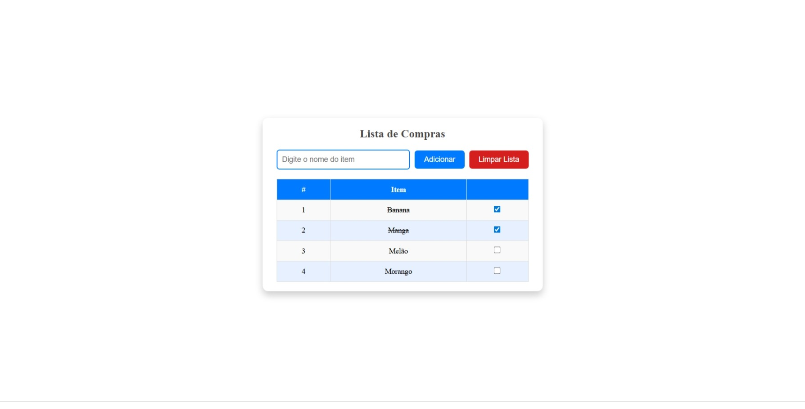

# Exercício 02 – Lista de Compras

Neste exercício foi desenvolvido um **aplicativo de lista de compras**, com foco na criação de formulários e na comunicação entre componentes, aplicando os fundamentos do TypeScript no Angular.



## Tecnologias Utilizadas

- **Angular 19**
- **TypeScript**
- **Angular CLI**

## Conceitos Abordados

- Formulários
- Comunicação entre Components
- Métodos e Classes
- Fundamentos do TypeScript
- Organização de componentes

## :information_source: Instalação

### Pré-requisitos

- **Node.js**
- **Angular CLI**
- **Git**

### Passos para executar

```bash
# Acesse a pasta do projeto
cd lista-compras

# Instale as dependências
npm install

# Execute o projeto
ng serve --open

# Acesse
http://localhost:4200
