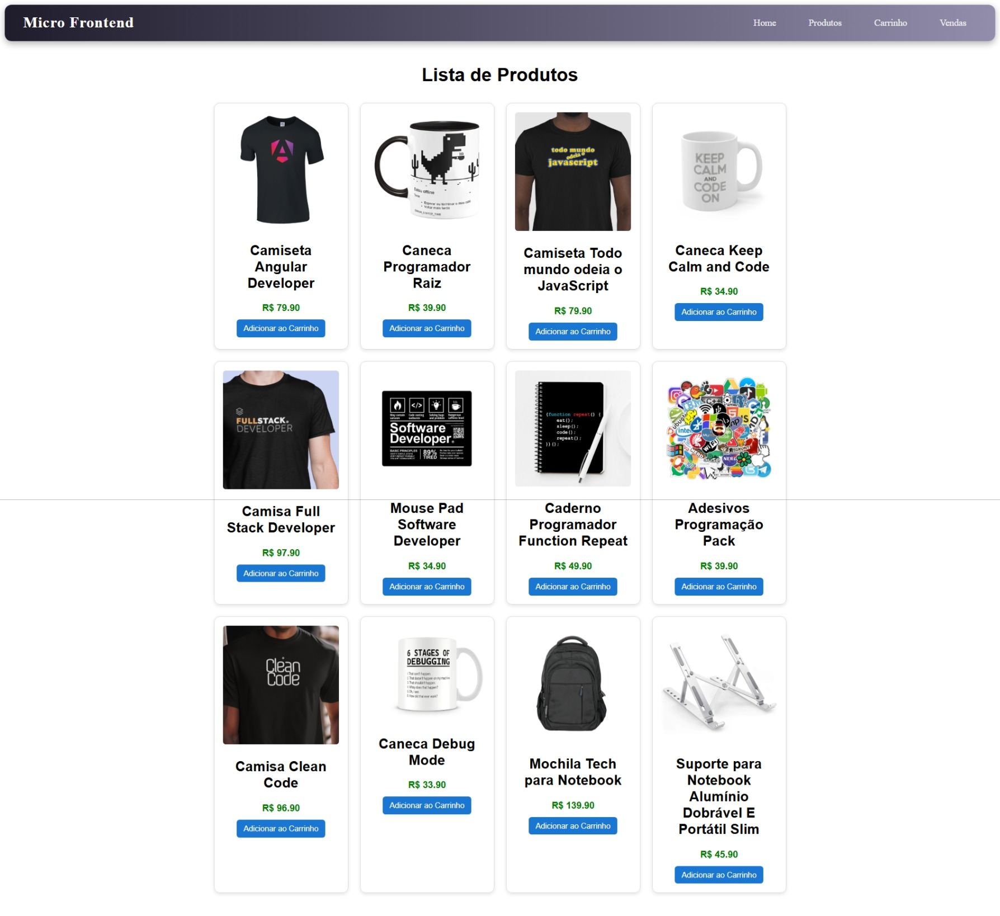
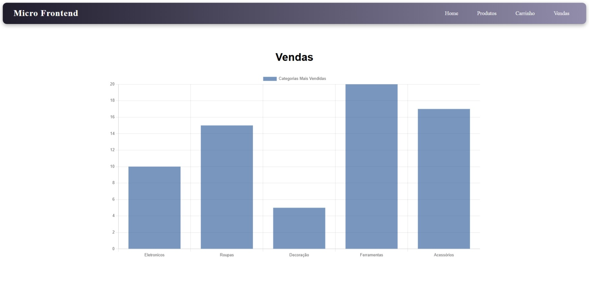

# Exercício 05 – Micro-Frontends com Angular 20

Este exercício aborda uma **arquitetura avançada de Micro-Frontends**, utilizando **Module Federation**, separação de domínios e deploy com Docker.




## Tecnologias Utilizadas

- **Angular 20**
- **Module Federation**
- **Micro-Frontends**
- **Docker**
- **TypeScript**

## Conceitos Abordados

- Arquitetura de Micro-Frontends
- Module Federation
- Comunicação entre aplicações
- Build e Deploy
- Docker

## :information_source: Instalação

### Pré-requisitos

- **Node.js**
- **Angular CLI**
- **Docker**
- **Git**

### Passos para executar

```bash
# Acesse a pasta do projeto
cd microfront-ends

# Instale as dependências
npm install

# Execute o projeto
ng serve --open

# Acesse
http://localhost:4200
