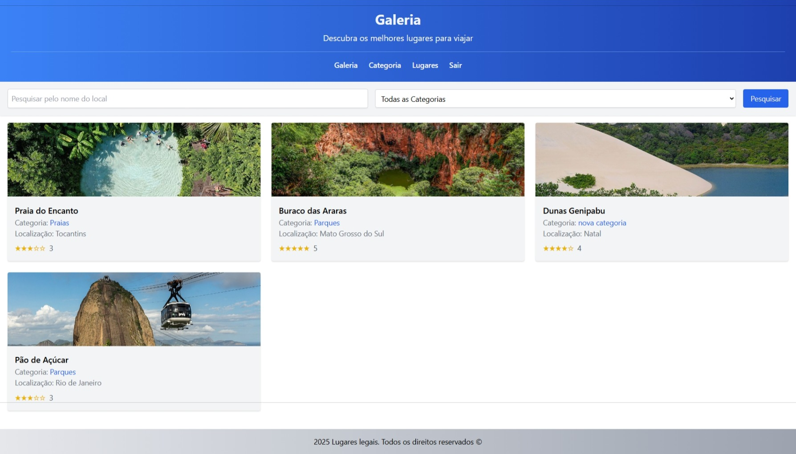

# Exercício 04 – Passeio App

Neste projeto foi desenvolvido um aplicativo completo com **Reactive Forms**, **autenticação OAuth2 com Google** e consumo de uma **API REST criada com JSON Server**.




## Tecnologias Utilizadas

- **Angular 20**
- **Reactive Forms**
- **OAuth2 com Google**
- **JSON Server**
- **TypeScript**

## Conceitos Abordados

- Reactive Forms
- Autenticação OAuth2
- Guards de rotas
- Criação de API REST
- Boas práticas REST
- Consumo de API com Angular

## :information_source: Instalação

### Pré-requisitos

- **Node.js**
- **Angular CLI**
- **Git**

### Passos para executar

```bash
# Acesse a pasta do projeto
cd passeio-app

# Instale as dependências
npm install

# Execute o projeto
ng serve --open

# Acesse
http://localhost:4200
